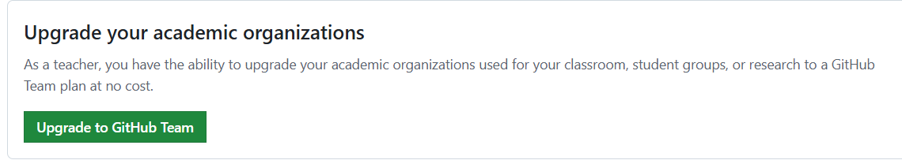
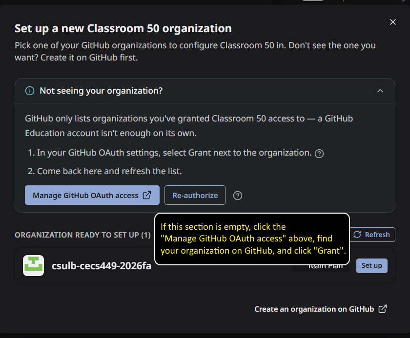
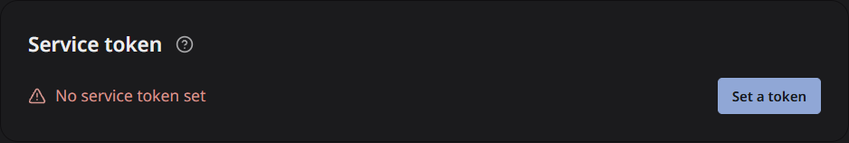

# Getting started with the Web UI — your first autograded assignment

For faculty who have never set up an autograder. No prior Classroom 50 or
command-line experience assumed. Budget about 45 minutes the first time;
subsequent assignments take five.

By the end you will have a real assignment that students can accept, and you
will have **proved** it grades correctly rather than assumed it.

> [!TIP]
> Prefer the terminal? Use [Getting started with the CLI](classroom-50-setup.md).
> Already know Classroom 50? You want the upstream
> [Web Teacher Guide](https://github.com/foundation50/classroom50/wiki/Web-Teacher-Guide)
> instead. This is the ground-up version.

---

## Before you start

You need:

- A [GitHub account](https://github.com/).
- A GitHub **organization** you own, which will hold repositories for your classrooms, your assignments, and student work.
- A Team or Enterprise plan for that organization; verified educators can get
  GitHub Team through [GitHub Education](https://education.github.com/benefits).
  
- A way to clone, commit, and push for the verification in step 7, such as Git,
  GitHub Desktop, an IDE with Git support, or even GitHub in your browser.

No other software is required. The teacher setup in this guide happens at [classroom50.org](https://classroom50.org/).

---

## Step 1 — Sign in and initialize the organization

Once per organization, ever.

1. Open [classroom50.org](https://classroom50.org/) and click **Sign in with
   GitHub**. Use **device code** only if the normal browser flow does not work.
2. During authorization, grant Classroom 50 access to the organization you
   will use. If it does not appear afterward, an organization owner may need to
   approve the OAuth app in the organization's GitHub settings.
3. Click **Set up new organization**, find the organization and click **Set
   up**, then **Run setup**.
   
   
   Setup creates `<org>/classroom50` as a private config repository, installs the grading workflows, enables Pages, and configures the organization for Classroom 50.

4. Create a service token and paste the access code to Classroom 50, which will give it permission to manage repositories in the organization.

    


The organization card should now say **Ready**. **Needs service token** means
setup is only partly complete: assignments can be created, but score collection
will not work.

---

## Step 2 — Build a template repo

This is the assignment content. Make an ordinary GitHub repository containing:

```
src/                    importable starter package
  __init__.py
  stats.py
tests/                  pytest test suite
  test_stats.py
requirements.txt        Python dependencies
docs/student/           instructions and practical guides for students
VERIFICATION-LOG.md     AI-assistance disclosure record
```

Then, on GitHub, open **Settings → General**, find **Template repository**, and
check it.

**Don't build one from scratch the first time.** Use **this repository**: click
**Use this template** on
[cecs-golden-template-python](https://github.com/Giacalone-CECS/cecs-golden-template-python).
It has the layout, a working suite, CI, and a Verification Log, and every file
carries `FACULTY:` comments explaining why it is shaped that way. See
[the repo README](../../README.md) for what to keep and what to change.

---

## Step 3 — Add a classroom

A classroom is one course section for one term.

1. Return to [classroom50.org](https://classroom50.org/) and click **Open** on
   your organization, or go directly to `https://classroom50.org/<org>`.
2. On **My classrooms**, click **Create classroom**.

3. Enter:
   - **Name:** the full display name, such as `CECS 378 — Fall 2026`.
   - **Slug:** a short identifier, such as `cecs-378-fa26`.
   - **Term:** optional, but useful when the course repeats.
4. Click **Create classroom**.

The slug becomes part of every student repo name
(`<classroom>-<assignment>-<username>`), so pick something you will still want
to read in six months.

Leave **Use an unlisted link for this classroom** off unless you specifically
need an unguessable public gradebook URL. An unlisted link is obscurity, not
access control: anyone who gets the link can read the published files.

---

## Step 4 — Add students

Students must be on the roster and must join the GitHub organization before
they can accept an assignment.

1. Open the classroom's **Students** page.
2. You can add students individually, in bulk, or by generating a Classroom 50 onboarding link. 

Adding a student records them in the classroom, invites them to the GitHub
organization, and gives the classroom team the access it needs.


---

## Step 5 — Register the assignment

On the classroom page, click **+ Assignment**. Enter:

- **Name:** `Lab 1 — Descriptive Statistics`
- **Description:** optional student-facing context
- **Due date:** optional; it marks later submissions late but does not prevent
  pushing or accepting
- **Assignment type:** **Individual** for this example

Under **Repository setup**:

1. Choose **Template repository** for **Start with a template**.
2. Enter the `<owner>/<repo>` name of the Python template copy you made in step 2.
3. Leave **Include all branches** off unless students need more than the
   template's default branch.
4. Leave **Feedback pull request** on if you want a ready-made place for inline
   review comments.

Repository settings are copied when each student accepts. Changing the
template or these provisioning settings later does not retrofit repositories
that already exist.

Do **not** click **Create assignment** yet. The same form continues with the
grading configuration in step 6.

---

## Step 6 — Tell it how to grade

Under **Grading and submissions**:

1. Set **Grading** to **Autograded**.
2. Select **Use the built-in autograder**.
3. Leave **Submission type** at **Every push to the default branch** for this
   first assignment.

Under **Advanced settings**, set the assignment **Setup command** to install the
Python dependencies:

```sh
python3 -m pip install --quiet -r requirements.txt
```

Leave its timeout at 120 seconds. Then add these tests under **Autograding
tests**:

| Field | Import guard | Pytest suite |
|---|---|---|
| **Test name** | `module imports` | `pytest suite` |
| **Test type** | Run command | Python (pytest) |
| **Run command** | `python3 -c "import src.stats"` | `python3 -m pytest -q tests/test_stats.py` |
| **Required exit code** | `0` | — |
| **Timeout** | `10` | `120` |
| **Points** | `1` | `12` |

Add and save both tests, then confirm they appear in the assignment. The cheap
import guard gives a direct message for syntax and import failures. The Python
test type uses pytest's case report to divide its points across the twelve
sample cases.

Now click **Create assignment**.

> [!CAUTION]
> There are three different ways to accidentally create something that does
> not grade: leave **Grading** at **Not graded**, choose **Do not use the
> built-in autograder**, or configure the built-in autograder with no tests. In
> the last case, an empty grading configuration can report **0/0, success**.
> Seeing green is not proof that grading works.

Full detail on test types and weighting:
**[Writing tests with the Web UI](writing-tests-web.md)**.

---

## Step 7 — Prove it actually grades

> [!CAUTION]
> **Do not skip this step.** It is the only one that distinguishes a working
> autograder from a broken one.

1. Open the assignment and expand **How students accept**.
2. Copy the accept URL and open it while signed in as the enrolled GitHub
   account you are using for the test.
3. Click **Accept assignment**. Classroom 50 creates a student repository and
   shows a link to it.
4. Clone that repository with GitHub Desktop, your IDE, or Git.
5. Deliberately break something: change one function to return an incorrect
   result, or leave the starter implementation incomplete.
6. Commit and push the deliberately wrong version.
7. In Classroom 50, open the assignment, choose **My submission**, and click
   **View grade**; or open the repository's **Actions** tab and inspect the
   autograding run.

| What you see | What it means |
|---|---|
| ❌ **Red, with named failing tests** | ✅ Working. Ship it. |
| ✅ Green, score `0/0` | ❌ No real tests were configured. Edit **Assignment settings** and redo step 6. |
| ✅ Green with real points | ❌ Your "wrong" submission was not wrong. Break it harder. |
| No autograding run | ❌ The assignment is not using the built-in autograder, or the push did not match its submission type. |

Now fix the code and push again to confirm it goes green for the right reason.
Once it fails correctly and passes correctly, you are done. Everything after
this is repetition.

You may delete the test student repository afterward. If you used your normal
account, you can also leave it in place as a known-good smoke test for later
grading changes.

---

## Step 8 — Collect scores

Open the assignment's submissions page. In the freshness strip at the top,
click **Sync now**. The equivalent action also appears as **Collect now** in the
**Actions** menu.

Classroom 50 starts a score-collection workflow for this assignment. Click
**View workflow** to inspect it. When it finishes, return to the submissions
page and refresh if necessary; the test submission and its score should appear.

Scores are also collected nightly. **Sync now** is worth doing immediately
because it proves the service token from step 1 can read student repositories.

A permissions failure here almost always means the service token's **Resource
owner** is your personal account instead of the organization. Return to the
organization setup, create an organization-owned token, save it, and sync
again.

Use **Actions → Download scores (CSV)** when you need the gradebook outside
Classroom 50.

---

## What to read next

| You want to | Read |
|---|---|
| Write more interesting tests | [Writing tests with the Web UI](writing-tests-web.md) |
| Diagnose something broken | [Troubleshooting](troubleshooting.md) |
| Adapt this template to your course | [Template README](../../README.md) |
| Look up a Web UI feature | [Web Teacher Guide](https://github.com/foundation50/classroom50/wiki/Web-Teacher-Guide) |
| See the student Web UI | [Web Student Guide](https://github.com/foundation50/classroom50/wiki/Web-Student-Guide) |
| Grade something declarative tests cannot express | [Autograders wiki](https://github.com/foundation50/classroom50/wiki/Autograders) |
